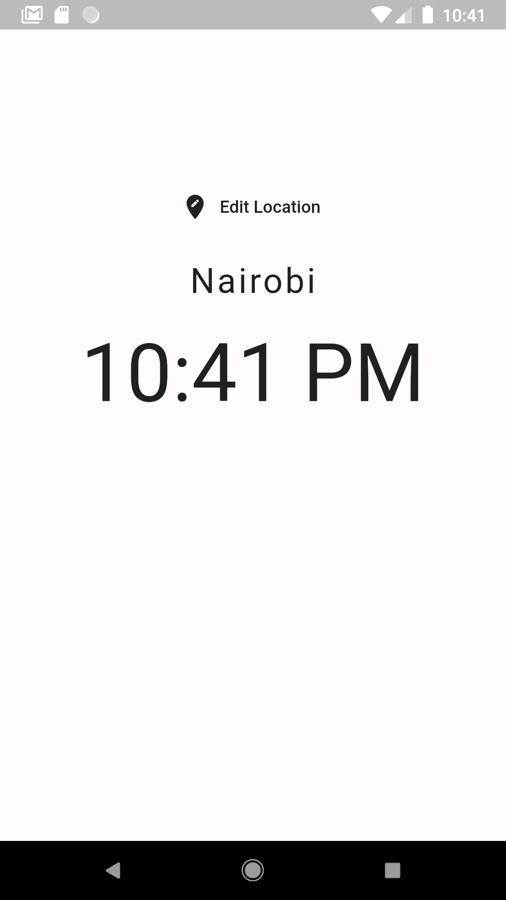

# world_time_app

A new Flutter application.

## This is a course by Net Ninja on Youtube 
### the course is free by the war and is <a href="https://github.com/iamshaunjp/flutter-beginners-tutorial">here!</a>
#### you will learn about many concepts like
<ul>
  <li>How to get data from api using Map() function</li>
  <li>APi</li>
  <li>Many more......</li>
</ul>

This project is a starting point for a Flutter application.

A few resources to get you started if this is your first Flutter project:

- [Lab: Write your first Flutter app](https://flutter.dev/docs/get-started/codelab)
- [Cookbook: Useful Flutter samples](https://flutter.dev/docs/cookbook)

For help getting started with Flutter, view our
[online documentation](https://flutter.dev/docs), which offers tutorials,
samples, guidance on mobile development, and a full API reference.
